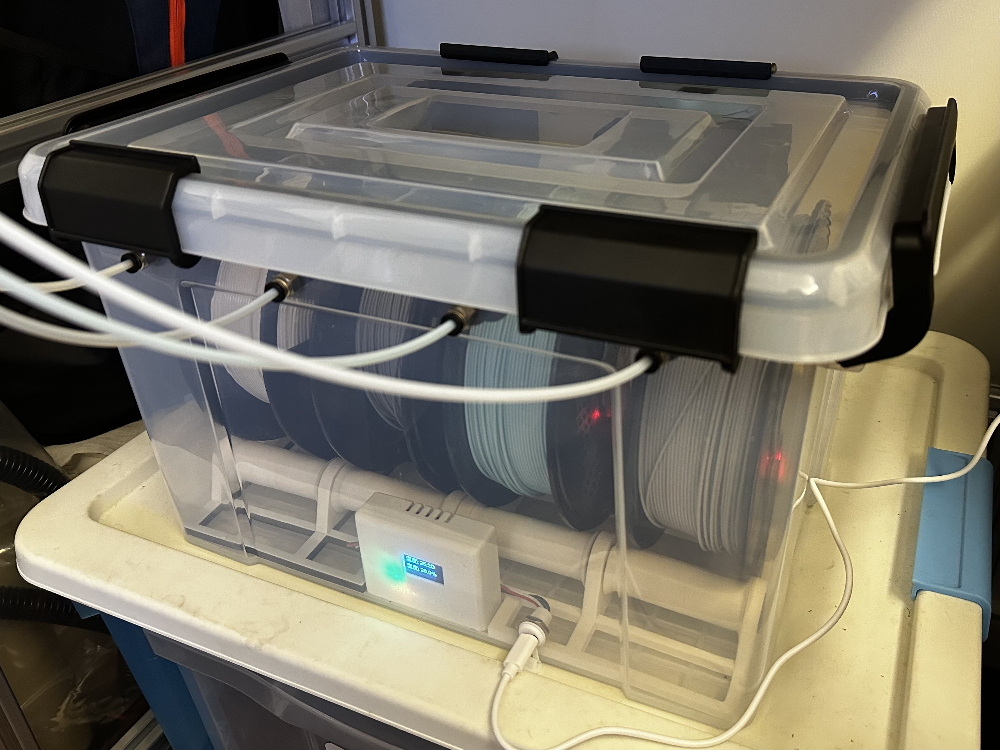
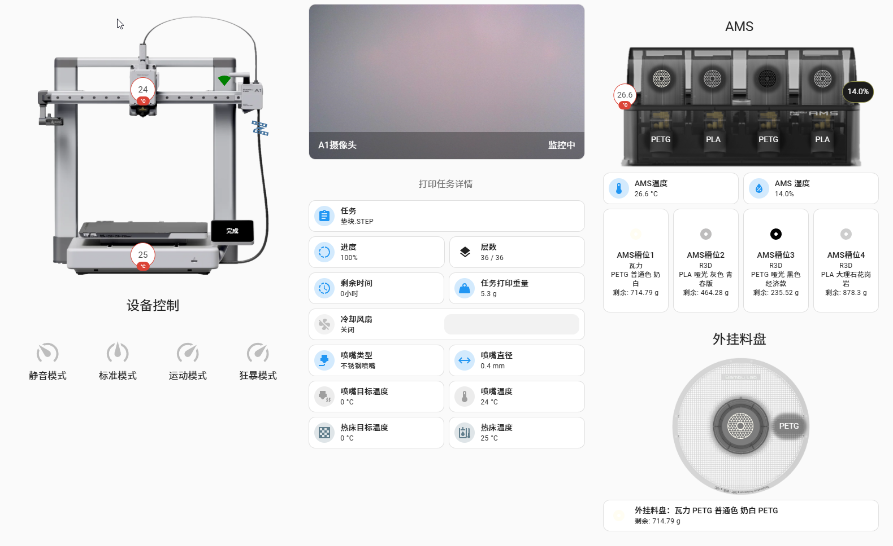
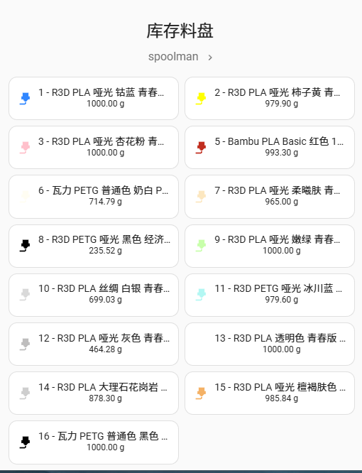
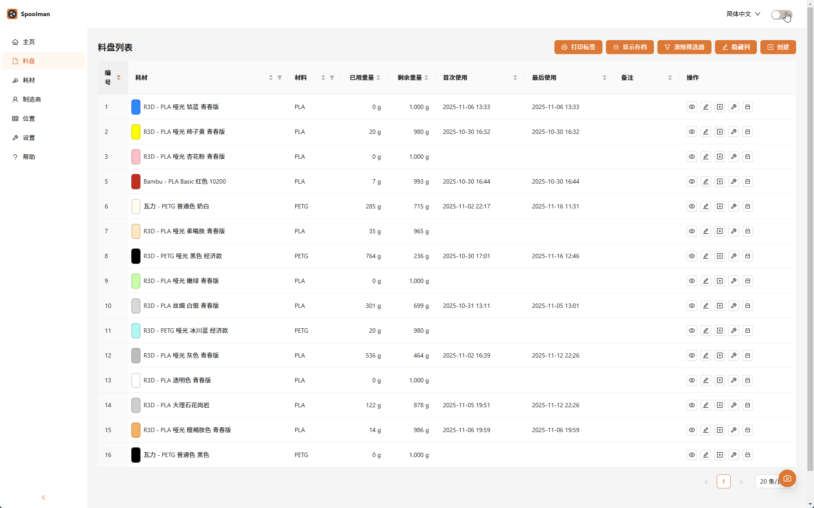

# ANS（AMS NFC Sensor）NFC感应自动耗材管理系统

## 许可证

本项目根据 [GNU General Public License v3.0](https://www.gnu.org/licenses/gpl-3.0.html) 许可证开源。
This project is licensed under the [GNU General Public License v3.0](https://www.gnu.org/licenses/gpl-3.0.html).

## 项目概述

本项目实现了一个基于 ESP32 ，专为自动材料系统 (AMS) 设计，适用于拓竹 3D 打印（目前测试于拓竹A1机型）的NFC耗材管理方案。
传感器部分集成 MFRC522 NFC 读卡器以识别耗材卷轴，一个 DHT22 传感器用于环境监测（温度和湿度），以及一个 SSD1306 OLED 显示屏用于本地状态更新。
所有收集到的数据都发布到 MQTT 代理，从而实现与homeassistant无缝集成。通过node-red流程自动更新打印机耗材预设（支持自定义预设），通过homeassistant与Spoolman耗材管理系统的对接，实现耗材余量管理。
当前版本开发板程序使用 uasyncio 异步I/O模型，以实现更高效的并发任务处理。

[功能演示](http://xhslink.com/o/3PXhxWrZeBu)

==注意：本方案需一定的动手能力，需要一定的网络知识和电路知识，需要手动焊接电路，且需要有长期在线服务器一台（NAS、软路由、HA盒子均可）。==

## 截图

## 功能特性

  * **NFC 标签读取:** 利用4个 MFRC522 读卡器检测和识别支持 NFC 的耗材卷轴。
  * **环境监测:** 集成的 DHT22 传感器提供实时温度和湿度数据。
  * **OLED 显示:** SSD1306 OLED 屏幕显示当前状态、传感器读数和配置消息。
  * **MQTT 集成:** 将 NFC 标签 ID、温度和湿度数据发布到可配置的 MQTT 代理。
  * **网页配置门户:** 在无配置文件的情况下，通过网页界面轻松设置 WiFi 、MQTT 代理。
  * **耗材余量管理:** 接入spoolman自动进行耗材余量管理，任务结束后自动发送通知。
  * **Homeassistant仪表盘:** 调试完成的HA仪表盘，打印状态、耗材余量一览无余。

## 配置指南

  [点击查看文档](https://kxy7latko94.feishu.cn/wiki/GABEwGJxaiWu4Zk9BCKcpalhnGg?from=from_copylink)

## TODO

### ESP32 开发板

  - [x] PCB制版
  - [x] 建模外壳及底座
  - [x] 增加配置网页
  - [x] 增加温湿度数据，OLED 显示
  - [x] 更改 MQTT 上报数据
  - [x] 增加重置配置功能
  - [x] 迁移到异步架构

### Node-RED 流程

  - [x] 按打印进度计算耗材用量并更新Spoolman
  - [x] 根据 Spoolman 信息匹配更新 AMS/外挂料盘耗材种类与颜色
  - [x] 自动同步外挂料盘状态到打印机配置
  - [x] 增加温湿度接口和监控
  - [x] 更多的通知方式（Server酱、Bark、Synochat）

### Home Assistant 集成

  - [x] 完整的仪表盘配置
  - [x] 温度和湿度传感器集成
  - [x] 料盘槽位状态显示
  - [x] 与 Spoolman 集成显示耗材信息

## 致谢
  * 感谢 @叮叮当当 大佬一语点醒梦中人。
  * 感谢 嘉立创 让科技创新更高效。